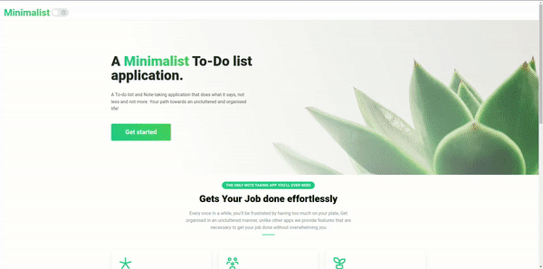

<!-- Project Title -->
# 🪴 MinimaList: A To-Do List application

<!-- Project Description -->
Minimalist is a Simple to-do and note-taking app with UI and features heavily inspired by Notion.

## 🔆 Features

- Create Lists, with support for real-time updates.
- Create Todos, that have Rich Text Editor Functionality, You can bold, underline, justify, mark as code or quote, and much more.
- Seamless UI Just type and it gets updated, no need to click the save button or press ctrl + s, Autosave is probably the best feature.
- Drag and drop to order your lists as well as todos, inspired by notion.

## 💽 Technologies Used

- Front-end: React.js, MantineUI.
- Back-end: Java Spring Framework, Reactive (Spring webFlux), Spring Security, Mapstruct, Lombok.
- Database: MongoDB
- Architecture: MVC
- PWA: Service Workers, Manifest

## 🔥 MinimaList In Action

